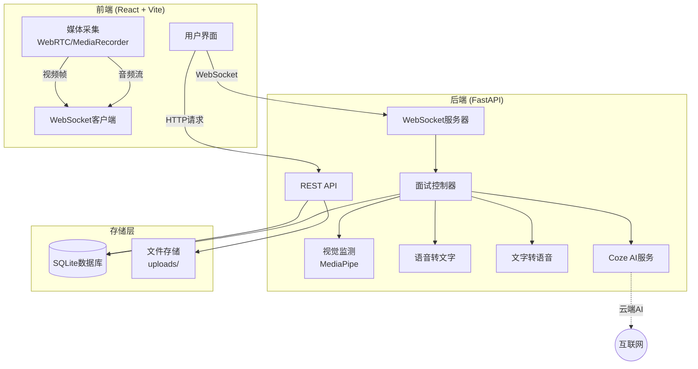
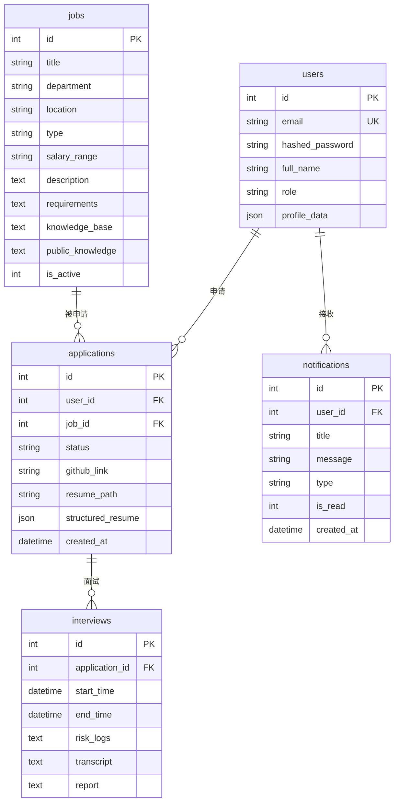

# 设计文档 (Design Document)

## 概述 (Overview)

AI智能面试系统采用"本地感官+云端大脑"的分布式架构，将计算密集型的AI推理任务委托给云端服务（Coze），而将实时性要求高的视觉监测保留在本地。系统通过WebSocket实现低延迟的双向通信，支持音视频流的实时传输与处理。

核心设计理念：
- **前后端分离**: React SPA + FastAPI REST/WebSocket
- **异步优先**: 利用Python asyncio和JavaScript Promise处理并发
- **模块化服务**: STT、TTS、Coze、Observer各司其职，便于替换和扩展
- **状态机驱动**: 面试流程通过明确的状态转换保证逻辑清晰

## 架构 (Architecture)

### 系统架构图



### 数据流架构

**面试流程数据流**:
```
候选人说话 → 前端录音 → WebSocket传输 → 音频缓冲区 → STT转文字 
→ Coze生成回复 → TTS合成语音 → WebSocket传输 → 前端播放
```

**视觉监测数据流**:
```
摄像头画面 → 前端抽帧 → Base64编码 → WebSocket传输 
→ Observer分析 → 风险日志 → 存储到数据库
```

## 组件与接口 (Components and Interfaces)

### 1. 认证模块 (Authentication Module)

**职责**: 处理用户注册、登录、JWT令牌生成与验证

**接口**:
```python
# POST /auth/register
Request: {
    "email": str,
    "password": str,
    "full_name": str
}
Response: {
    "id": int,
    "email": str,
    "full_name": str,
    "role": str
}

# POST /auth/login
Request: {
    "email": str,
    "password": str
}
Response: {
    "access_token": str,
    "token_type": "bearer",
    "user": {...}
}
```

**核心逻辑**:
- 密码使用bcrypt哈希存储
- JWT令牌包含user_id和role，有效期24小时
- 依赖注入`get_current_user`用于保护需要认证的端点

### 2. 职位管理模块 (Job Management Module)

**职责**: CRUD操作职位信息，区分公开知识库和内部知识库

**接口**:
```python
# GET /jobs
Response: List[{
    "id": int,
    "title": str,
    "department": str,
    "location": str,
    "type": str,
    "salary_range": str,
    "description": str,
    "requirements": str,
    "public_knowledge": str,  # 对候选人可见
    # knowledge_base 不返回给候选人
}]

# POST /jobs (Admin only)
Request: {
    "title": str,
    "department": str,
    "location": str,
    "type": str,
    "salary_range": str,
    "description": str,
    "requirements": str,
    "knowledge_base": str,  # 仅供AI使用
    "public_knowledge": str
}
```

### 3. 申请管理模块 (Application Module)

**职责**: 处理候选人申请提交、简历上传、状态跟踪

**接口**:
```python
# POST /applications
Request: {
    "job_id": int,
    "github_link": str (optional),
    "resume_file": File (optional)
}
Response: {
    "id": int,
    "status": "pending",
    "created_at": datetime
}

# GET /applications/me
Response: List[{
    "id": int,
    "job": {...},
    "status": str,
    "created_at": datetime
}]
```

**文件处理**:
- 简历文件存储在`uploads/`目录
- 文件名格式: `resume_{user_id}_{job_id}_{timestamp}.pdf`
- 支持的格式: PDF, DOCX

### 4. 简历解析模块 (Resume Parser Module)

**职责**: 提取简历结构化信息，生成候选人画像

**核心函数**:
```python
async def parse_resume(file_path: str) -> dict:
    """
    解析简历文件，提取结构化信息
    
    Returns:
    {
        "personal_info": {
            "name": str,
            "email": str,
            "phone": str
        },
        "education": List[{
            "degree": str,
            "institution": str,
            "year": str
        }],
        "experience": List[{
            "title": str,
            "company": str,
            "duration": str,
            "description": str
        }],
        "skills": List[str]
    }
    """
```

**实现策略**:
- PDF解析: 使用PyPDF2或pdfplumber
- DOCX解析: 使用python-docx
- 信息提取: 使用正则表达式或LLM辅助提取

### 5. WebSocket面试控制器 (Interview Controller)

**职责**: 协调面试流程，管理会话状态，调度各个服务

**状态机**:
```
IDLE → PROCESSING → LISTENING → PROCESSING → SPEAKING → LISTENING → ... → FINISHED
```

**核心方法**:
```python
class InterviewController:
    async def connect(session_id: str, websocket: WebSocket)
    async def disconnect(session_id: str)
    async def handle_event(session_id: str, data: dict)
    async def handle_audio_stream(session_id: str, audio_chunk: bytes)
    async def start_interview(session_id: str, candidate_info: dict)
    async def process_user_response(session_id: str)
```

**事件类型**:
```typescript
// 前端发送
type ClientEvent = 
    | { type: "START_INTERVIEW", payload: CandidateInfo }
    | { type: "USER_FINISHED_SPEAKING" }
    | { type: "VIDEO_FRAME", payload: string } // Base64

// 后端发送
type ServerEvent =
    | { type: "STATE_CHANGE", state: string }
    | { type: "AI_RESPONSE", text: string }
    | { type: "INTERVIEW_END" }
```

### 6. 视觉监测模块 (Observer Agent)

**职责**: 使用MediaPipe分析视频帧，检测异常行为

**核心功能**:
```python
class ObserverAgent:
    async def analyze_frame(session_id: str, frame_base64: str):
        """
        分析单帧图像
        - 检测人脸是否存在
        - 估计视线方向
        - 检测多人情况
        """
    
    def get_latest_report(session_id: str) -> str:
        """
        返回最近的风险日志摘要
        """
```

**风险检测规则**:
- 无人脸检测: 连续3秒无人脸 → 记录"候选人离开"
- 视线偏移: 视线角度偏离屏幕超过30度持续5秒 → 记录"视线异常"
- 多人检测: 检测到多张人脸 → 记录"多人出现"

### 7. 语音服务模块 (Speech Services)

**STT服务**:
```python
class STTService:
    async def transcribe(audio_data: bytes) -> str:
        """
        将音频转换为文字
        支持格式: WAV, MP3, WebM
        """
```

**TTS服务**:
```python
class TTSService:
    async def synthesize(text: str) -> bytes:
        """
        将文字合成为语音
        返回格式: MP3或WAV
        """
```

**实现选项**:
- Mock实现: 用于开发测试
- OpenAI Whisper + TTS API
- Azure Speech Services
- Google Cloud Speech-to-Text/Text-to-Speech

### 8. Coze AI编排服务 (Coze Service)

**职责**: 调用字节跳动Coze平台，实现面试对话逻辑

**接口**:
```python
class CozeService:
    async def chat(
        session_id: str,
        user_message: str,
        context: dict
    ) -> str:
        """
        发送消息到Coze Bot
        
        context包含:
        - candidate_profile: 候选人画像
        - job_knowledge: 职位知识库
        - visual_signal: 视觉监测报告
        - conversation_history: 对话历史
        """
```

**Coze Bot配置**:
- 工作流节点: 意图识别 → 知识库检索 → 回复生成 → 行动决策
- 知识库: 每个职位的knowledge_base作为独立知识库
- 插件: 候选人画像查询、风险评估

### 9. 通知模块 (Notification Module)

**职责**: 管理系统通知的创建、查询和标记

**接口**:
```python
# GET /notifications
Response: List[{
    "id": int,
    "title": str,
    "message": str,
    "type": "info" | "success" | "warning" | "error",
    "is_read": bool,
    "created_at": datetime
}]

# PUT /notifications/{id}/read
Response: { "success": true }
```

**触发场景**:
- 申请状态变更: pending → interviewing → review → offered
- 面试安排: 新面试会话创建
- 系统消息: 重要公告

## 数据模型 (Data Models)

### 数据库表结构

**users表**:
```sql
CREATE TABLE users (
    id INTEGER PRIMARY KEY,
    email VARCHAR UNIQUE NOT NULL,
    hashed_password VARCHAR NOT NULL,
    full_name VARCHAR NOT NULL,
    role VARCHAR DEFAULT 'candidate',
    profile_data JSON  -- 候选人画像
);
```

**jobs表**:
```sql
CREATE TABLE jobs (
    id INTEGER PRIMARY KEY,
    title VARCHAR NOT NULL,
    department VARCHAR,
    location VARCHAR,
    type VARCHAR DEFAULT '全职',
    salary_range VARCHAR,
    description TEXT,
    requirements TEXT,
    knowledge_base TEXT,  -- 内部知识库
    public_knowledge TEXT,  -- 公开知识库
    is_active INTEGER DEFAULT 1
);
```

**applications表**:
```sql
CREATE TABLE applications (
    id INTEGER PRIMARY KEY,
    user_id INTEGER REFERENCES users(id),
    job_id INTEGER REFERENCES jobs(id),
    status VARCHAR DEFAULT 'pending',
    github_link VARCHAR,
    resume_path VARCHAR,
    structured_resume JSON,  -- 解析后的简历数据
    created_at DATETIME DEFAULT CURRENT_TIMESTAMP
);
```

**interviews表**:
```sql
CREATE TABLE interviews (
    id INTEGER PRIMARY KEY,
    application_id INTEGER REFERENCES applications(id),
    start_time DATETIME,
    end_time DATETIME,
    risk_logs TEXT,  -- JSON格式的风险日志数组
    transcript TEXT,  -- 完整对话记录
    report TEXT  -- AI生成的评估报告
);
```

**notifications表**:
```sql
CREATE TABLE notifications (
    id INTEGER PRIMARY KEY,
    user_id INTEGER REFERENCES users(id),
    title VARCHAR,
    message VARCHAR,
    type VARCHAR DEFAULT 'info',
    is_read INTEGER DEFAULT 0,
    created_at DATETIME DEFAULT CURRENT_TIMESTAMP
);
```

### 数据关系



