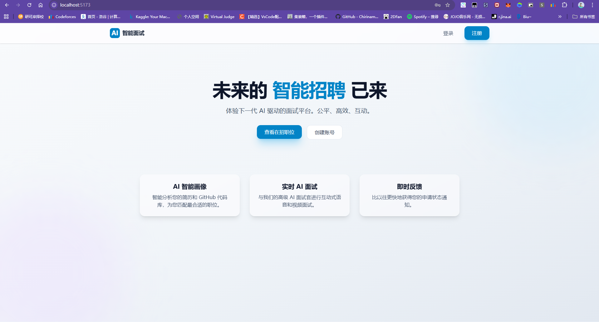
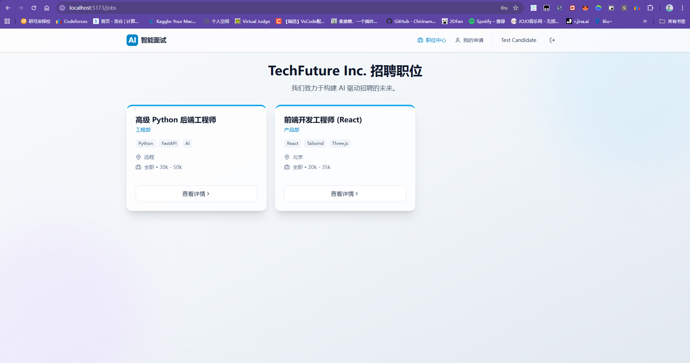
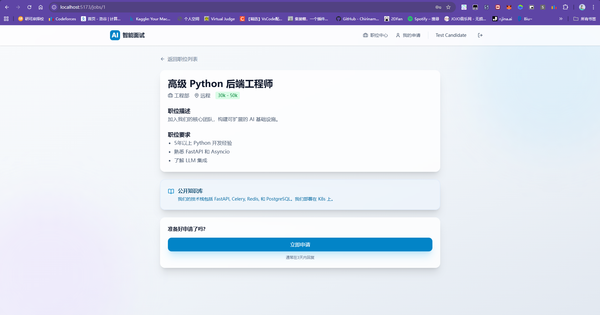
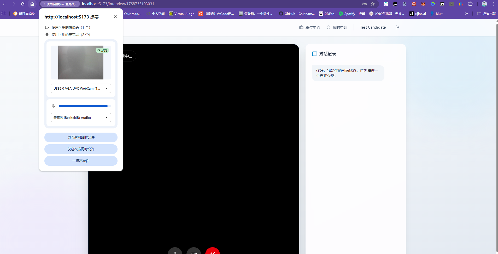
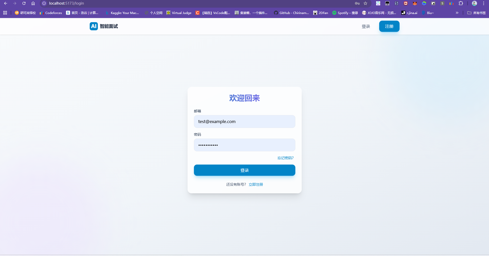

# AI 智能面试系统 (AI Interviewer System)

> **未来的智能招聘已来** —— 体验下一代基于 "本地感官 + 云端大脑" 架构的 AI 面试平台。公平、高效、互动。



## 📖 项目简介

本项目是一个全流程的 AI 自动化面试系统，旨在通过技术手段还原真实的面试场景。它融合了计算机视觉（CV）、语音交互（ASR/TTS）与大语言模型（LLM）编排技术，实现了从简历投递到 AI 视频面试的完整闭环。

主要解决传统招聘中 **筛选效率低**、**面试时间协调难**、**评价主观性强** 等痛点。

## ✨ 核心功能与界面展示

### 1. 沉浸式职位与简历管理
前端采用现代化 UI 设计（Tailwind CSS），提供清晰的职位列表与详情展示。候选人可以查看职位JD、薪资范围及企业公开知识库。

| 职位中心 | 职位详情 |
| :---: | :---: |
|  | *查看职位具体要求与关联知识库* |

### 2. 智能投递与状态追踪
候选人提交申请后，系统会自动进行简历解析与人岗匹配（AI Profiling）。在 "我的申请" 面板中，候选人可以实时查看流程进度（简历分析中 -> 待面试 -> 面试中 -> 已完成）。



### 3. 全流程 AI 视频面试 (核心)
这是本系统的核心亮点。进入面试间后，系统将接管整个面试流程：
*   **视觉感知**: 集成 MediaPipe 实时监测候选人面部状态（是否在位、视线是否专注）。
*   **语音交互**: 支持全双工语音对话，模拟真实人类交流节奏。
*   **实时反馈**: 面试官状态实时可见（聆听中、思考中、说话中）。



### 4. 安全便捷的认证体系
支持邮箱/密码登录与注册，包含完整的表单验证与错误提示，保障用户数据安全。



## 🛠️ 技术架构

### 后端 (Backend)
*   **框架**: FastAPI (高性能异步 Python 框架)
*   **通信**: WebSocket (实现低延迟音视频流与信令传输)
*   **视觉 AI**: Google MediaPipe (本地实时人脸特征点检测)
*   **逻辑编排**: Coze Workflow (字节跳动扣子，负责面试逻辑与知识库调用)
*   **数据库**: SQLAlchemy + SQLite (轻量级持久化存储)

### 前端 (Frontend)
*   **框架**: React 18 + Vite
*   **样式**: Tailwind CSS (原子化 CSS) + Lucide Icons
*   **交互**: Framer Motion (平滑动画效果)
*   **流媒体**: WebRTC / MediaRecorder API (音视频采集与传输)

## 🚀 快速开始

### 1. 环境准备
*   Python 3.8+
*   Node.js 16+
*   摄像头与麦克风（用于面试体验）

### 2. 后端启动
```bash
# 在项目根目录下
python start_backend.py
```
服务默认运行在: `http://localhost:8000`

### 3. 前端启动
```bash
cd frontend
npm install
npm run dev
```
访问地址: `http://localhost:5173`

### 4. 测试账号
为了方便体验，系统预置了测试账号：
- **邮箱**: `test@example.com`
- **密码**: `password123`

## 📂 目录结构
```text
.
├── backend/                # Python 后端核心代码
│   ├── main.py             # FastAPI 入口与 WebSocket 路由
│   ├── observer.py         # MediaPipe 视觉观察者实现
│   ├── services.py         # Coze API 与 业务逻辑封装
│   └── ...
├── frontend/               # React 前端代码
│   ├── src/pages/          # 页面组件 (Dashboard, Interview, etc.)
│   ├── src/context/        # 全局状态管理
│   └── ...
├── docs/                   # 项目文档与资源图片
└── start_backend.py        # 后端启动脚本
```

## ⚙️ 配置说明
- **Coze API**: 修改 `backend/services.py` 中的 `CozeService` 类，填入您自己的 Coze Bot Token 以启用真实的 AI 对话能力。
- **STT/TTS**: 目前项目内含 Mock 实现，如需接入真实语音服务（如 OpenAI Whisper/TTS），请在后端服务层进行配置。
